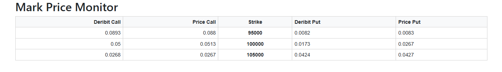

# Mark price calculator

This application provides a real-time dashboard for monitoring Bitcoin option mark prices on Deribit.
It displays both custom-calculated and Deribit-provided prices for calls and puts options across different strikes.
It is built with Python and Dash and designed for modularity and ease of extension.

## Installation

Use the package manager [pip](https://pip.pypa.io/en/stable/) to install the required packages:

```bash
pip install numpy pandas threading websocket certifi scipy datetime dash dash_bootstrap_components
```

## Usage

From the root directory, edit the custom inputs on main.py and run the script:

```python
# Inputs example:
expiry_code = "23MAY25"
t1 = 3600                          # Run the app for 3600 seconds
t2 = 2                             # Update prices each 2 seconds
strikes = [95000, 100000, 105000]  # Strikes to keep track

# Start the app
calculator = MarkPriceCalculator(expiry_code, t1, t2, strikes)
threading.Thread(target=calculator.run, daemon=True).start()
run_app(calculator)
```

Then open a browser (tested on Chrome) and go to:

```cpp
http://127.0.0.1:8050/
```

You will see the table for custom computed prices and Deribit prices.



## Feature

+ Real-time updates every `t2` seconds for a total duration of `t1` seconds.
+ Displays a two-sided table:
  + **Left side**: Deribit and custom price for call options
  + **Middle**: Strikes
  + **Right side**: Deribit and custom price for put options
+ Clear separation between data logic and user interface:
  + `MarPriceCalculator`: All logic for fetching, computing and storing prices
  + `run_app`: Visualization layer that listens for data updates

## Rationale and Key Assumptions

To compute realistic mark prices for a wide range of strike prices, I implemented a dual-method approach that adapts
based on option liquidity:

### 1. Order Book-Based Mark Pricing (Primary Method)

For each option contract with available order book data, I subscribe to live order book updates to track the best 
bid and best ask prices. The mark price is computed using the formula:

```console
mark_price = index_price + EMA(( best_bid + best_ask ) / 2 - index_price)
```

Where:
+ `index_price` is te Deribit index price of BTC
+ `EMA` is the *Exponential Moving Average* with a time window of 2.5 minutes

This approach is inspired by available literature, aiming to smooth out short-term price noise
and mitigate the impact of market manipulation near illiquid strikes or expiry boundaries.

### 2. Black-Scholes Fallback (Low-Liquidity or Missing Order Book)

If a contract's order book data is unavailable or incomplete, a fallback pricing method is used based on the
Black-Scholes model:

Where:
+ The underlying asset price (BTC) and historical volatility are fetched directly from the Deribit API.
+ Option prices are then computed using the Black-Scholes formula, assuming European-style options and continuous markets.

This ensures that we can still estimate prices for low-volume strikes, or newly listed expiries.

## Challenges

1. **Ensuring Reliable API Communication**  
The Deribit API serves as the backbone of the application. It was essential to manage:
   + Proper authentication and request formatting
   + Real-time WebSocket subscriptions to maintain live data streams without dropouts
2. **Concurrency and Multithreading**  
To track multiple option contracts in parallel and handle live order book updates:
   + A proper multithreaded architecture was needed to avoid blocking calls
3. **Fallback Logic for Missing Order Books**  
During tests, I noticed that some option contracts don’t have active order books, requiring:
   + A decision-making layer to fall back to Black-Scholes pricing
   + Real-time retrieval of underlying and volatility data
4. **Data Synchronization and Storage**  
Maintaining and updating a shared memory structure for the latest prices across threads required:
   + Thread-safe design of the `MarkPriceCalculator`
   + Efficient data structures for low-latency access by the Dash interface
5. **Designing a Clear and Informative UI**  
Visualizing a wide matrix of calls and puts efficiently involved: 
   + Designing a table layout that groups related data logically
   + Handling refreshes smoothly without freezing or flickering
   + Ensuring the interface reflects real-time updates without overwhelming the user